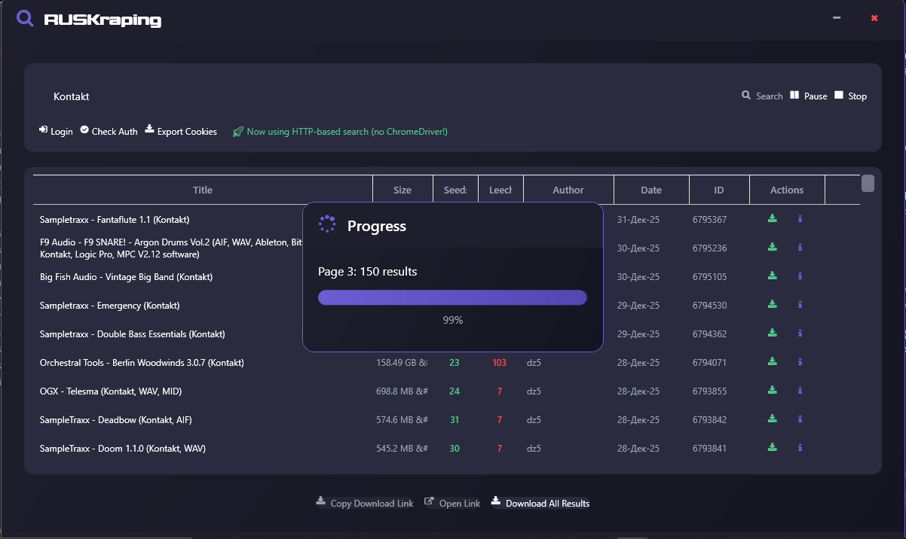
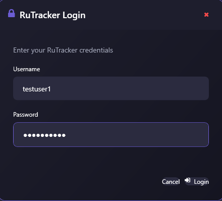

# RUSKRAPING

A Windows desktop application for downloading torrents from RuTracker. Download single files or bulk downloads .


## Requirements

### For Automated Login
- **Google Chrome** must be installed on your system
- The application uses Selenium WebDriver to automate the login process through Chrome

### Alternative: Manual Cookie Method
If you prefer not to use Chrome automation, you can manually obtain your RuTracker session cookies and use them directly in the application.

## Screenshots

### Main Interface


### Login Interface


### Download All Results Button


## Installation

### Option 1: Download Latest Release


### Option 2: Build from Source
1. Ensure you have **.NET 9 SDK** installed
2. Clone this repository:
   ```bash
   git clone https://github.com/yourusername/RuSkraping.git
   cd RuSkraping
   ```
3. Build the application:
   ```bash
   dotnet build
   ```
4. Run the application:
   ```bash
   dotnet run
   ```

## Usage

1. **Launch the application**
2. **Login**:
   - **Automated**: Click the login button and the app will open Chrome to authenticate
   - **Manual**: Enter your RuTracker session cookies manually
3. **Search** for torrents or browse the latest releases
4. **Download**:
   - Click on individual torrents to download single files
   - Use the "Download All Results" button to download multiple torrents at once

## Building with .NET 9

This project targets **.NET 9.0** and requires the .NET 9 SDK to build.

```bash
# Restore dependencies
dotnet restore

# Build the project
dotnet build --configuration Release

# Run the application
dotnet run
```

## Technologies Used

- **.NET 9.0** - Framework
- **WPF** - User Interface
- **Selenium WebDriver** - Browser automation
- **FontAwesome.WPF** - Icons


